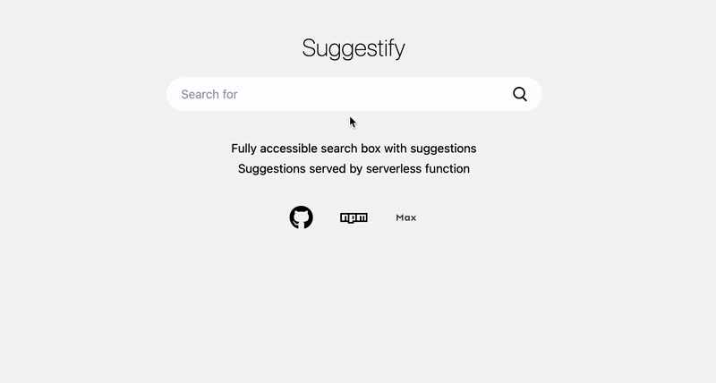

# 🕵 Suggestify

**Fully accessible search box with suggestions (Suggestions served by serverless function)**

Please note: this project is a personal project I made available and will probably keep changing things to my liking or personal usage. Also, the serverless function with the suggestion logic is not included; I'm working on it and want to keep it for myself for now :)

### 🌎 Browser support

-   Chrome
-   Edge (Chrome)
-   Firefox
-   Safari

# 🐎 Getting started

### Install

```bash
$ yarn add suggestify
```

Set up your HTML

```html
<div id="suggestify" role="search">
	<input placeholder="Search..." aria-label="Search input" />
	<button aria-label="Delete input"></button>
	<button type="submit" aria-label="Search"></button>
</div>
```

Import the files in your Javascript or TypeScript file

```js
// import Suggestify
import Suggestify from 'suggestify';

// Init and config
new Suggestify(...);
```

### Configure

The selector can either be a `string` or `HTMLElement`

```js
new Suggestify('#sugestify', {
	// Redirect url with search input
	url: '/search?q=', // default: ?q=

	// Suggestion engine url
	engine: 'https://example.com/search-api', // default: /api/search

	// Class to add to elements
	class: 'my-class', // default: suggestify

	// Remove suggestions if user clicks outside search box
	blur: true, // default: true

	// Add <i> in button element for custom icon styling
	icon: true, // default: true

	// Give suggestions instantly on load
	instant: false, // default: false

	// Translations for banner text
	translations: {
		suggestions: 'Most used search results', // default: Suggestions
		results: 'Nothing to see', // default: No suggestions found
	},
});
```

### 🎉 Styling

`scss` is included and only works with `suggestify` class.

```scss
@import 'suggestify/style.scss';
```

The cleaner version is to copy the styling and adjust it to your liking.

# 👨‍💻 Development

### 📦 Requirments

-   [Node.js v14 or higher](https://nodejs.org/en/)
-   [Yarn v1.22 or higher](https://yarnpkg.com/lang/en/)
-   ☕ Coffee

### 🏇 QuickStart

1. Type in the terminal:

    ```bash
    # install dependencies
    $ yarn

    # run dev
    $ yarn dev
    ```

2. Open your browser and navigate to [http://localhost:3000](http://localhost:3000)

3. Add a suggestion engine (not included, see data model) and provide the URL in `src/main.ts`

### 📐 Data model

The suggestion engine is not included in the project. Instead, I will provide you with the output, which you can use to build it yourself.

Three types are used for different cases.

1. suggestions: is used for initial suggestions

    ```js
    {
        type: 'suggestions',
        items: ['item', ...],
        time: '0ms'
    }
    ```

2. results: for normal suggestion results
    ```js
    {
        type: 'results',
        items: ['item', ...],
        time: '0.05ms'
    }
    ```
3. empty: if no results are found > which also means the response has an empty items `array`
    ```js
    {
        type: 'empty',
        items: [],
        time: '0.01ms'
    }
    ```

Happy coding 🎉
